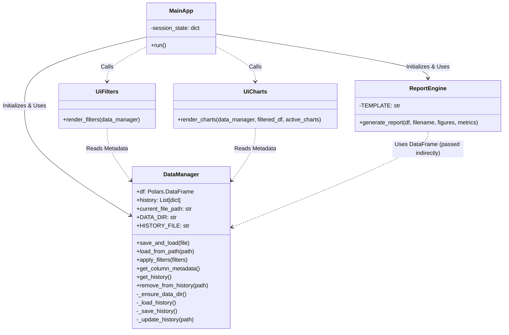
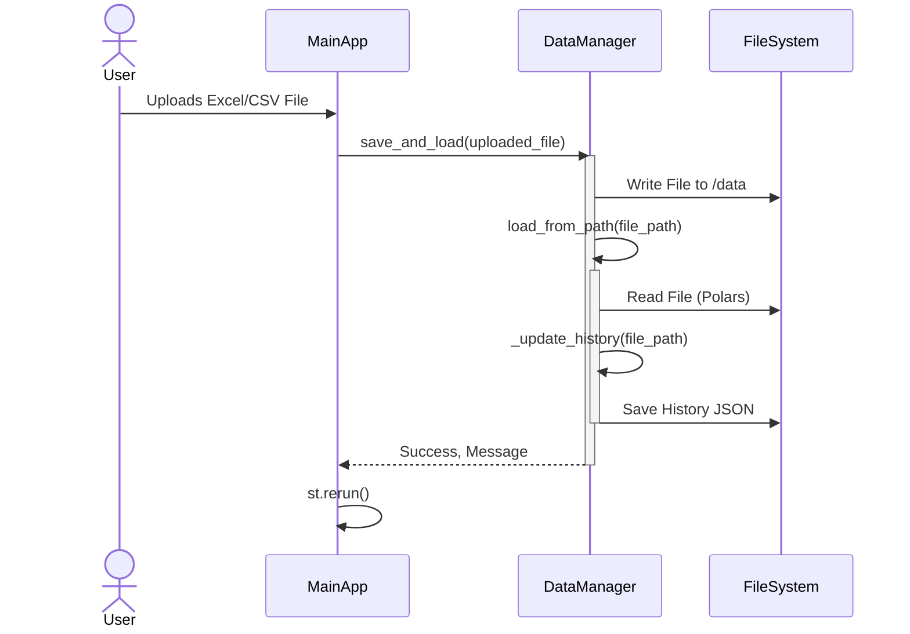
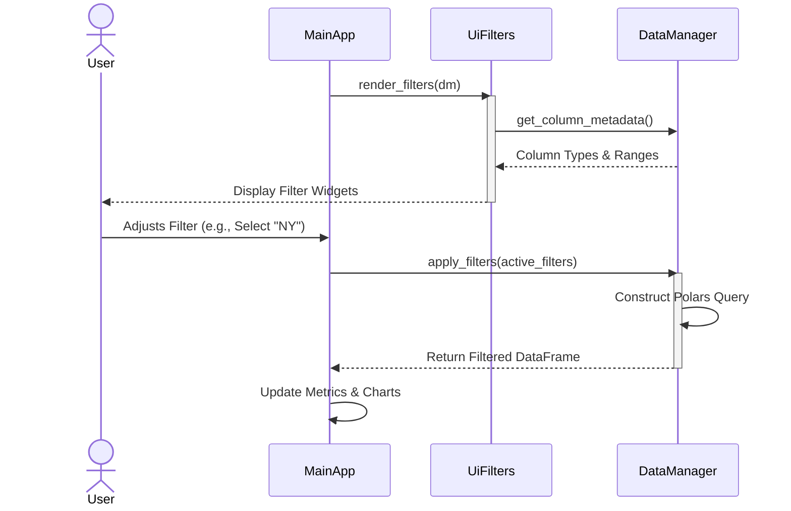
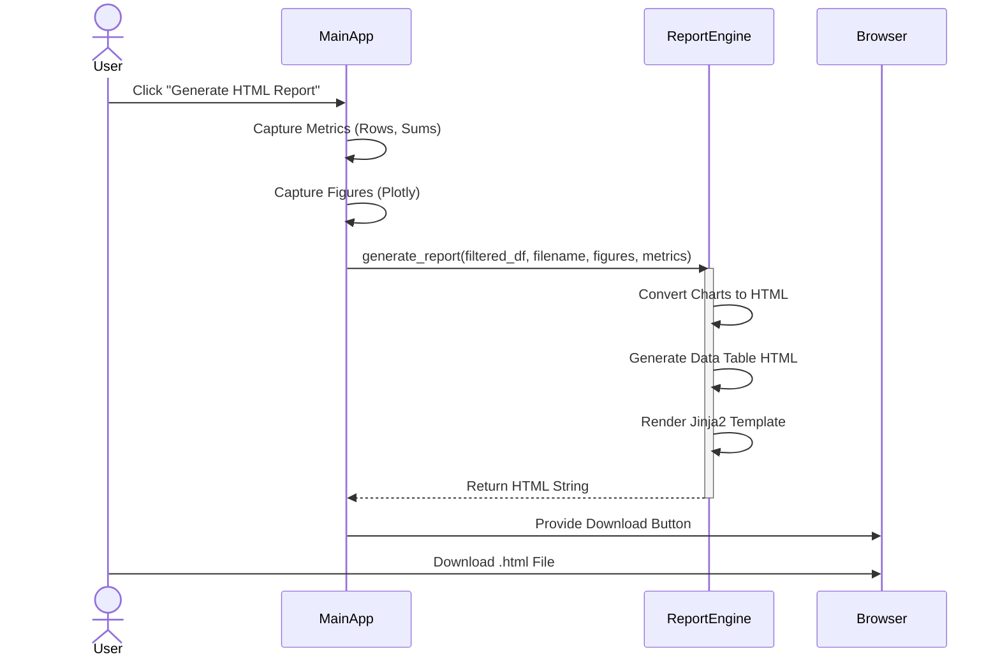
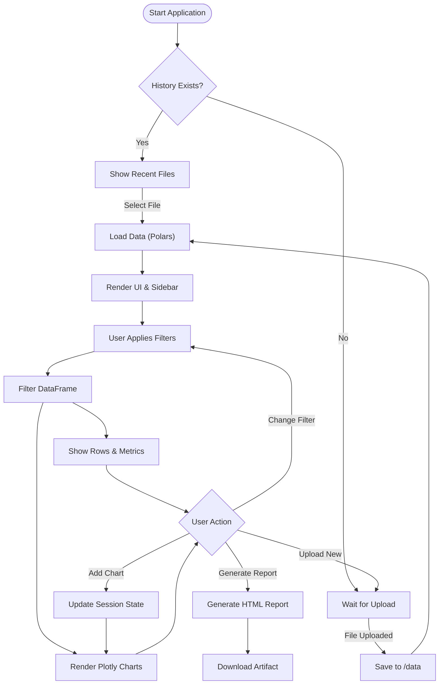

# ExcelTool Architecture & UML Diagrams

This document provides a technical overview of the Excel Analysis Tool using UML diagrams. It covers the static structure (Class Diagram) and dynamic behavior (Sequence Diagrams).

## 1. Class Diagram

The Class Diagram illustrates the main components of the application and their relationships.

### Component Description
- **MainApp (`main.py`)**: The entry point and controller. It manages the Streamlit session state and orchestrates the UI layout.
- **DataManager (`src/core/data_manager.py`)**: The core logic provider. It handles file I/O, manages the data using Polars, maintains file history, and provides filtering capabilities.
- **ReportEngine (`src/core/report_engine.py`)**: Responsible for generating the standalone HTML report. It takes the processed data and visualizations and renders them into a template.
- **UiFilters (`src/ui/filters.py`)**: A functional module that renders the sidebar filters based on the data columns.
- **UiCharts (`src/ui/charts.py`)**: A functional module that handles the creation and rendering of Plotly charts based on user selection.

---

## 2. Sequence Diagrams

### 2.1 File Loading Workflow
This diagram shows what happens when a user uploads a new file.

### 2.2 Filtering Data Workflow
How data is filtered and updated in the UI.

### 2.3 Report Generation Workflow
How the HTML report is created.

---

## 3. High-Level System Flow

This flowchart represents the user journey and data processing loop within the application.

